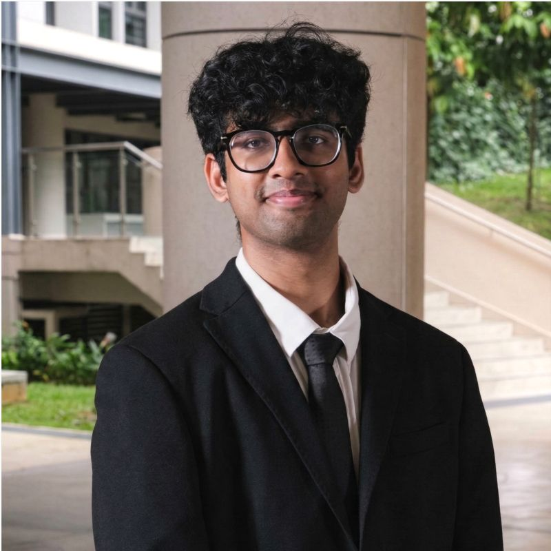

# About Us

|                                                                                              Display                                                                                               | Name | GitHub Profile | Portfolio |
|:--------------------------------------------------------------------------------------------------------------------------------------------------------------------------------------------------:|:----:|:--------------:|:---------:|
|  | Nishchay Sanghi | [Github](https://github.com/Nishchay2576) | [Portfolio](team/nishchay2576.md) |
|                                                                                                                                                | Annika Garg | [Github](https://github.com/annikagarg) | [Portfolio](team/annikagarg.md) |
|                                                                                                                                                | Trijal Srimal | [Github](https://github.com/TrijalSrimal) | [Portfolio](team/trijalsrimal.md) |
|                                                                                                                                                                        | Aryan Yadav | [Github](https://github.com/aruyadav13) | [Portfolio](team/aruyadav13.md) |
|                                                                    | Krishna Bajaj | [Github](https://github.com/KrishnaBajaj1506) | [Portfolio](team/krishnabajaj1506.md) |
