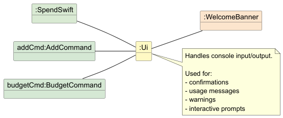
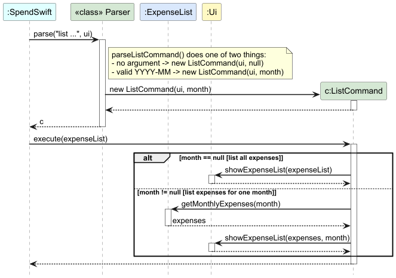
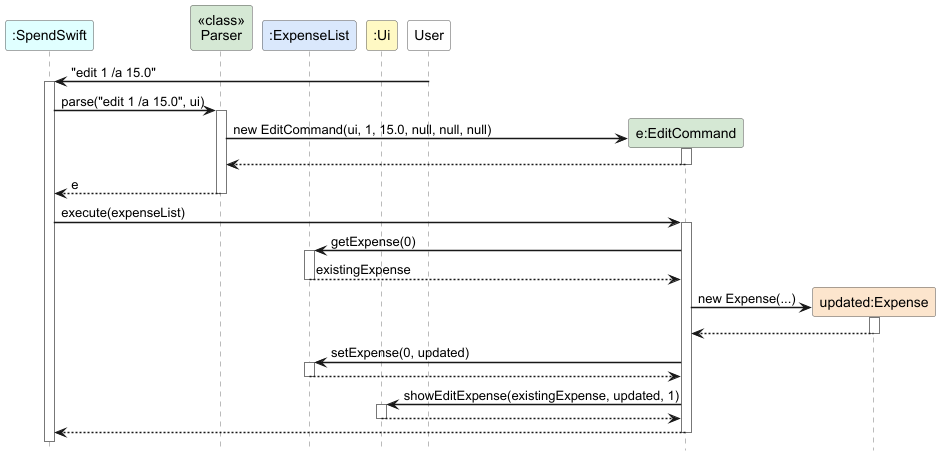
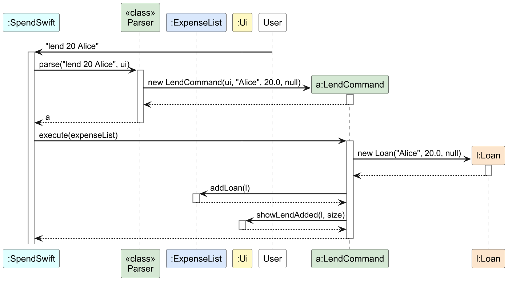
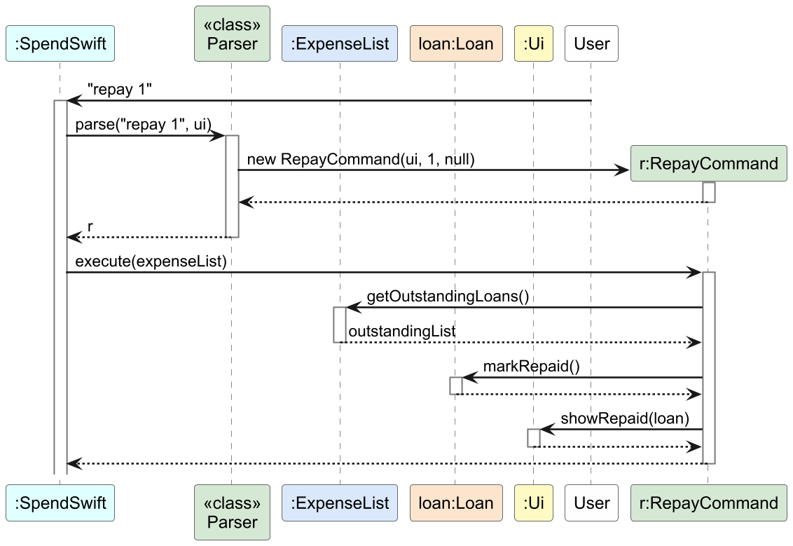
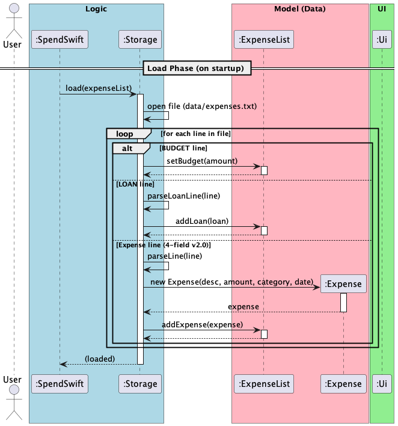
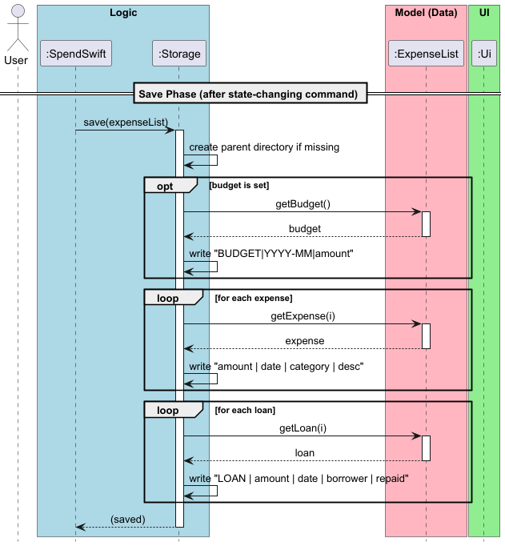
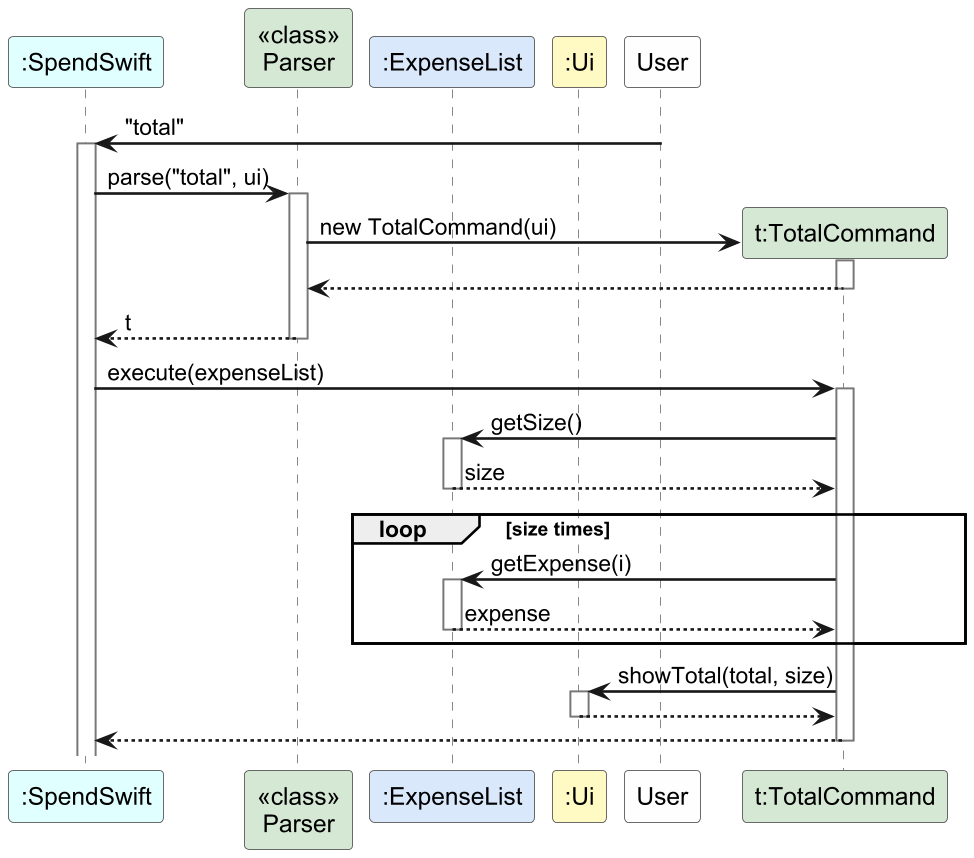
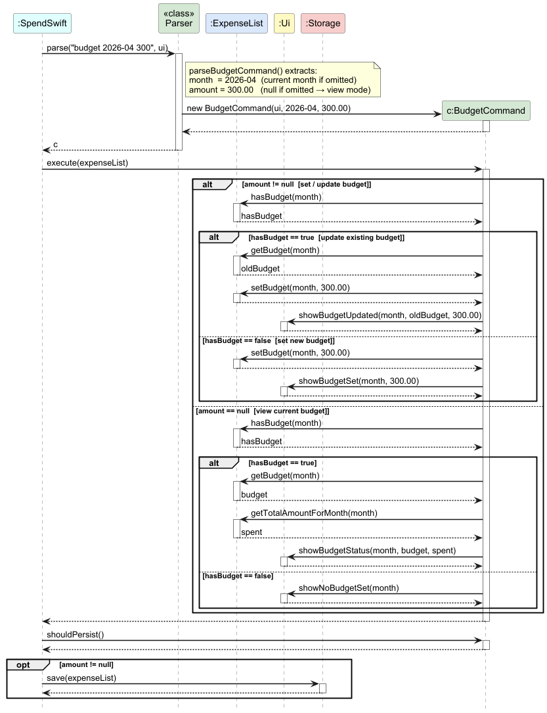

# Developer Guide

## Table of Contents
* [Acknowledgements](#acknowledgements)
* [Design & Implementation](#design--implementation)
   * [Ui Component](#ui-component)
   * [Add Feature](#add-feature)
   * [Delete Feature](#delete-feature)
   * [List Feature](#list-feature)
   * [Edit Expense Feature](#edit-expense-feature)
   * [Category and Date Parsing](#category-and-date-parsing)
   * [Loan Tracking System](#loan-tracking-system)
   * [Interactive Category Selection](#interactive-category-selection)
   * [Predictive Spending Forecast](#predictive-spending-forecast)
   * [Find / Filter Feature](#find--filter-feature)
   * [Help Feature](#help-feature)
   * [Storage & Persistence](#storage--persistence)
   * [Input Validation (Strict Commands)](#input-validation-strict-commands)
   * [Budget Feature](#budget-feature)
   * [Sort Feature](#sort-feature)
   * [Statistics Feature](#statistics-feature)
   * [Clear Feature](#clear-feature)
* [Product Scope](#product-scope)
   * [Target user profile](#target-user-profile)
   * [Value proposition](#value-proposition)
* [User Stories](#user-stories)
* [Non-Functional Requirements](#non-functional-requirements)
* [Glossary](#glossary)
* [Instructions for Manual Testing](#instructions-for-manual-testing)

## Acknowledgements

* This project is heavily based on the [Duke project template](https://se-education.org/duke/) created by the [SE-EDU initiative](https://se-education.org).
* Testing is supported by the [JUnit 5](https://junit.org/junit5/) framework.
* Project structure and documentation draw inspiration from the SE-EDU guidelines.

## Design & Implementation

This section describes the internal design of SpendSwift and explains how the main components and selected features are implemented.

At a high level, SpendSwift follows a command-based design. `SpendSwift` acts as the entry point of the application and coordinates the overall flow. User input is read through `Ui`, interpreted by `Parser` into a concrete `Command`, executed against `ExpenseList`, and saved through `Storage` when the command changes application state.

The main responsibilities are divided as follows:
- `Ui` handles all user-facing input and output.
- `Parser` converts raw user input into the appropriate command object.
- `Command` subclasses contain feature-specific execution logic.
- `ExpenseList` stores the in-memory application data.
- `Storage` loads data from disk on startup and persists changes after mutating commands.

The following subsections describe selected components and features in more detail.

### Ui Component

The `Ui` component centralises all user-facing input and output in SpendSwift. It is responsible for displaying confirmation messages, warnings, usage hints, summaries, and interactive prompts.

Unlike the business logic classes, `Ui` does not modify application state. Instead, command classes delegate user interaction responsibilities to it. For example, `AddCommand` uses `Ui` to display success messages and category prompts, while `BudgetCommand` uses it to show budget confirmations, status displays, and warning messages.

This design improves separation of concerns:
- command classes remain focused on application logic
- output formatting is kept in one place
- user interaction stays consistent across features

Below is a simplified object diagram showing a runtime snapshot of how the `Ui` object is used by other parts of the application:

*Figure 1: Simplified object diagram showing a runtime snapshot of the `Ui` component and related objects.*

**Design Considerations:**
- **Why centralise output in `Ui`?** Centralising output avoids duplicated `System.out.println(...)` logic across commands and makes message formatting easier to maintain.
- **Why allow `Ui` to read input as well?** Some features, such as interactive category selection, require the application to pause and collect additional user input after command parsing. Keeping this responsibility inside `Ui` prevents command classes from dealing directly with low-level console input.
- **Trade-off:** The `Ui` class contains many specialised methods, which makes it longer. However, this was preferred over spreading presentation logic throughout the codebase.

---

### Add Feature

The add feature allows users to record a new expense with a description, amount, optional category, and optional date.

**How it works:**
The user enters `add` followed by an amount and a description. The `/c` and `/da` flags may optionally be supplied to specify a category and date respectively.

**Implementation:**
`Parser.parseAddCommand()` first extracts the mandatory amount, then strips the optional `/c` and `/da` flags from the remaining input. The text left behind becomes the description. This allows the user to provide optional flags in any order without affecting parsing correctness.

A valid command results in the creation of an `AddCommand` object.

Below is the sequence of interactions when the user enters a valid command such as `add 5.50 Coffee /c Food`:

*Figure 2: Sequence Diagram detailing the Add feature execution.*

`AddCommand.execute()` operates by:
1. Checking whether a category was provided.
2. Triggering an interactive category prompt via `Ui` if the category is missing.
3. Creating a new `Expense` object with the resolved fields.
4. Adding the expense to `ExpenseList`.
5. Calling `Ui.showAddExpense()` to display a confirmation message.
6. Checking whether the newly added expense causes the total spending to exceed the budget.

**Design Considerations:**
- **Why support optional category and date flags?** This keeps the command flexible for both quick entry and detailed record keeping.
- **Why allow interactive category resolution after parsing?** It reduces friction for users who forget the `/c` flag, while still maintaining accurate categorisation.
- **Why keep budget checks outside the parser?** Parsing should only interpret user input. Budget validation belongs to the execution stage, after the expense has been created and added.

---

### Delete Feature

The delete feature allows users to remove expenses from their tracking list. It supports three modes: deletion by index (e.g., `delete 1`), batch deletion by category (e.g., `delete /c Food`), and batch deletion by date (e.g., `delete /da 2026-03-10`).

**How it works:**

The user types `delete` followed by either a single positive integer, `/c CATEGORY`, or `/da YYYY-MM-DD`.

**Implementation:**

`Parser.parseDeleteCommand()` inspects the argument to determine the deletion mode:
1. If the argument starts with `/c`, the remaining text is treated as a category name, and a `DeleteCommand` for batch-category deletion is created.
2. If the argument starts with `/da`, the remaining text is parsed as a date, and a `DeleteCommand` for batch-date deletion is created.
3. Otherwise, the argument is parsed as an integer index.

A valid input results in the instantiation of a `DeleteCommand`.

Below is the sequence of interactions when the user enters a valid command like `delete 1`:

*Figure 3: Sequence Diagram detailing the Delete feature execution.*

`DeleteCommand.execute()` operates by:
1. If a **category** filter is set: calling `ExpenseList.deleteByCategory(category)` to remove all matching expenses, then displaying the count via `Ui.showBatchDelete()`.
2. If a **date** filter is set: calling `ExpenseList.deleteByDate(date)` to remove all matching expenses, then displaying the count via `Ui.showBatchDelete()`.
3. If an **index** is set: validating the index is greater than `0`, then calling `ExpenseList.deleteExpense(index - 1)`. An `IndexOutOfBoundsException` is caught if the index exceeds the list size.
4. Showing a success message via `Ui.showDeleteExpense()` on successful index deletion.

Because deletion permanently removes persisted data, `DeleteCommand.shouldPersist()` returns `true`, triggering a file save.

---

### List Feature

The list feature allows users to display either all recorded expenses or only the expenses from a specific month using the `list` command.

**How it works:**
The user may enter:
- `list` to display all recorded expenses
- `list YYYY-MM` to display only the expenses recorded in the specified month

**Implementation:**
`Parser.parseListCommand()` checks whether an argument was supplied.

1. If no argument is provided, it creates a `ListCommand` with `month == null`.
2. If an argument is provided, it attempts to parse it into a `YearMonth`.
3. If parsing fails, `Ui.showInvalidMonthYear()` is called and `null` is returned.

A valid input results in the creation of a `ListCommand` object.

Below is the sequence of interactions when the user enters a valid command such as `list 2026-03`:

*Figure 4: Sequence Diagram detailing the List feature execution.*

`ListCommand.execute()` behaves differently depending on whether a month filter was supplied:

1. **No month filter (`month == null`)**
   - The command calls `Ui.showExpenseList(expenseList)`.
   - `Ui` prints either:
      - `Your expense list is currently empty.` if there are no recorded expenses, or
      - the full expense list otherwise.

2. **Month filter provided (`month != null`)**
   - The command retrieves the matching expenses using `ExpenseList.getMonthlyExpenses(month)`.
   - It then calls `Ui.showExpenseList(expenses, month)`.
   - `Ui` prints either:
      - `No expenses found for YYYY-MM.` if that month has no matching expenses, or
      - the filtered expense list otherwise.

**Design Considerations:**
- **Why use one command for both full and monthly listing?** This keeps the interface compact and intuitive. The optional `YYYY-MM` argument extends the command without introducing a separate command name.
- **Why keep month parsing in `Parser`?** Determining whether the argument is a valid `YearMonth` is part of command parsing, while the actual display logic belongs in `ListCommand` and `Ui`.
- **Why let `Ui` handle both full-list and month-filtered output?** This keeps all presentation logic in one place and avoids mixing formatting concerns into the command layer.

---

### Edit Expense Feature

The edit feature allows users to modify one or more fields of an existing expense using the `edit` command.

**How it works:**
The user provides a 1-based index followed by one or more optional flags (`/a` for amount, `/de` for description, `/c` for category, `/da` for date). At least one flag must be supplied, and the flags can appear in any order.

**Implementation:**
`Parser.parseEditCommand()` extracts the index and each flag sequentially. It strips the identified flag and its corresponding value from the working string, allowing the parser to handle the flags completely agnostic of their input order.

Below is the sequence of interactions when the user enters a valid command like `edit 1 /a 15.0`:

*Figure 5: Sequence Diagram detailing the Edit feature execution.*

In `EditCommand.execute()`:
1. The existing `Expense` at the given 0-based index is retrieved.
2. Because `Expense` objects are immutable, a **new** `Expense` object is created using the updated fields (or the existing fields if a specific flag was not provided).
3. The new object overwrites the old one via `ExpenseList.setExpense()`.
4. If the date was modified, the list is automatically re-sorted chronologically.
5. `ExpenseList.isOverBudget()` is called to warn the user if this edit pushes them over their monthly limit.

### Category and Date Parsing

Commands like `add` and `edit` support optional flags such as `/c` for category and `/da` for date.

`Parser` implements a robust stripping algorithm. For example, in `Parser.parseAddCommand()`, it first extracts the mandatory amount, then strips the `/da` and `/c` flags from the remaining input one at a time. The date token is parsed with `ResolverStyle.STRICT` to reject impossible calendar dates such as `2026-02-30`. Whatever text remains after the specified flags are removed becomes the description, which means the description does not need to appear in a fixed position relative to the flags.

### Loan Tracking System

The Loan Tracking System allows users to manage debts (money lent to others) completely separately from their primary expenses.

**Design Consideration:**
We chose to keep loans in a separate ledger (`ArrayList<Loan>`) rather than mixing them into the main `ExpenseList`. Treating a loan as a standard expense would artificially inflate the user's spending totals and trigger false "Budget Exceeded" warnings for money that was not actually consumed, ruining the integrity of the `stats` and `forecast` features.

**Implementation:**
The system is centered around the `Loan` class, which extends the `Expense` class to reuse basic validation logic but introduces a `borrowerName`, an `isRepaid` flag, and an `amountRepaid` tracker.

The ledger is managed by three specific commands:

1. **LendCommand**: Instantiates a `Loan` object and adds it to the internal loan list.

*Figure 6a: Sequence Diagram detailing the Lend feature execution.*

2. **LoansCommand**: Queries the `ExpenseList` to display the current loans. By default, it fetches only outstanding loans via `ExpenseList.getOutstandingLoans()`. If the user supplies the `/all` flag, it bypasses this filter to show both outstanding and historically settled debts.

3. **RepayCommand**: Rather than using an absolute index of the entire loan array, `RepayCommand` maps the user's 1-based index directly to the *filtered* list of outstanding loans. This significantly improves the UX, as users do not have to manually count past settled debts to find the correct index.

*Figure 6b: Sequence Diagram detailing the Repay feature execution.*

When executed, `RepayCommand` fetches the target `Loan`. If an amount is provided, it calls `loan.repay(amount)` to record a partial payment. If the repayment meets or exceeds the outstanding balance, or if no amount is provided, it calls `loan.markRepaid()` to permanently settle the debt.

**Storage Integration:**
To persist this parallel data structure, the `Storage` class was modified to support multiple data types in a single file. Loan entries are prefixed with the `LOAN |` marker (e.g., `LOAN | 20.0 | 2026-04-01 | Alice | false`). During `load()`, the `Storage` class identifies this prefix, parses the loan using `parseLoanLine()`, and routes it to `ExpenseList.addLoan()` rather than the standard expense list.

### Interactive Category Selection

**Overview**
The application features a dynamic, interactive category selection mechanism. When a user attempts to add an expense without explicitly providing a category flag (`/c`), the application gracefully pauses execution, displays a numbered list of available categories, and prompts the user to select an existing category or input a new one.

This feature ensures that users do not accidentally pollute a default "Others" category due to forgetfulness, maintaining the integrity of their financial tracking while providing a seamless User Experience (UX).

**Implementation**
The interactive category selection mechanism is primarily orchestrated by the `AddCommand` class, acting as the controller. It interacts heavily with the `Ui` class for presentation and the `ExpenseList` class for state management.

To ensure the architecture remains decoupled and follows the Single Responsibility Principle, the execution flow is broken down into three distinct phases: **UI Interaction**, **Category Resolution**, and **Expense Finalization**.

#### Phase 1: The UI Interaction Prompt
When `AddCommand#execute(ExpenseList)` is invoked, it first evaluates the `category` field parsed from the user's initial input. If this field is `null`, the command intercepts the normal execution flow to query the user.

1. `AddCommand` fetches the current master list of categories from `ExpenseList`.
2. It passes this list to `Ui#showCategoryPrompt()`, which formats and prints a numbered list to the terminal.
3. `AddCommand` then suspends execution by calling `Ui#getUserInput()`, waiting for the user to type their selection.

*Figure 7: Sequence Diagram detailing the UI Interaction phase.*

#### Phase 2: Dynamic Category Resolution
Once the user provides an input string, `AddCommand` must determine if the user typed a number (selecting an existing category) or a word (creating a brand new category).

If the user types a new category name (e.g., "Snacks"), `AddCommand` delegates the formatting and storage to `ExpenseList`. The `ExpenseList#addCategory()` method formats the string to Title Case (e.g., "snacks" -> "Snacks") and dynamically inserts it into the master list just above the "Others" category. This ensures "Others" always remains safely at the bottom of the user's UI prompt.

*Figure 8: Sequence Diagram detailing the parsing and dynamic storage of a new category.*

#### Phase 3: Expense Finalization & Budget Checking
With the category definitively resolved (either extracted from the numbered list or dynamically created), the `AddCommand` proceeds to finalize the data mutation.

1. A new `Expense` object is instantiated with the resolved category.
2. The object is appended to the `ExpenseList` via `addExpense()`.
3. `Ui#showAddExpense()` is called to print the success confirmation.
4. Finally, `AddCommand` queries `ExpenseList#isOverBudget()`. If the new expense pushes the total over the user's defined limit, it triggers a warning message via the `Ui`.

*Figure 9: Sequence Diagram detailing the final object creation and budget validation.*

**Design Considerations: Why it was implemented this way**
* **Strict Decoupling (Single Responsibility Principle):** The `AddCommand` acts strictly as an orchestrator. The `Ui` class knows nothing about how categories are saved, and the `ExpenseList` class knows nothing about `Scanner` inputs. They never communicate directly, which makes the codebase highly testable and modular.
* **The Open-Closed Principle for Categories:** Instead of hardcoding categories inside a Java `Enum` (which would require a code rewrite to add new ones), storing a dynamic `ArrayList<String>` inside `ExpenseList` allows the application to grow with the user's personalized spending habits.

**Alternatives Considered**
* **Alternative 1 (Strict Formatting Validation):** * *Design:* Throw an `IllegalArgumentException` in the `Parser` if the `/c` flag is missing, forcing the user to retype the entire command.
   * *Pros:* Very easy to implement. Keeps `AddCommand` execution strictly linear without needing pauses.
   * *Cons:* Creates a highly frustrating User Experience (UX). Power users typing quickly will constantly hit validation errors for forgetting a simple flag.
* **Alternative 2 (Silent Defaulting):** * *Design:* Automatically assign the expense to an "Others" category without prompting the user.
   * *Pros:* Immediate execution; keeps the `AddCommand` logic simple.
   * *Cons:* Leads to messy, inaccurate financial tracking. Users end up with the majority of their expenses dumped into a useless "Others" category, completely defeating the purpose of a budgeting application. The interactive prompt forces accurate categorization without making the user retype their description and amount.

### Predictive Spending Forecast
The `forecast` feature allows users to project their end-of-month spending based on current habits.

**Implementation details:**
The mechanism is contained within `ForecastCommand`. Because forecasting is an analytical action, `ForecastCommand#shouldPersist()` explicitly returns `false`, ensuring no unnecessary I/O operations are triggered.

1. The command fetches the current date using `LocalDate.now()` and extracts the current day and total days in the month.
2. It queries `ExpenseList#getTotalAmountForMonth(currentMonth)` to get the `spentSoFar` variable.
3. The formula `(spentSoFar / currentDay) * daysInMonth` is used to calculate the projected total.
4. A failsafe is included `(currentDay == 0 ? 1 : currentDay)` to ensure that if a user executes the command at the exact start of a new month, the application does not throw an `ArithmeticException` for division by zero.

---

### Find / Filter Feature

The find feature allows users to search and filter their expense list using a keyword and/or a combination of optional flags.

**How it works:**
The user types `find` followed by an optional keyword and any combination of the following flags:
- `/c CATEGORY` — filter by exact category match (case-insensitive)
- `/dmin DATE` — include only expenses on or after this date
- `/dmax DATE` — include only expenses on or before this date
- `/amin AMOUNT` — include only expenses at or above this amount
- `/amax AMOUNT` — include only expenses at or below this amount
- `/sort asc|desc` — sort results by amount (ascending or descending)

All filters are composable: `find lunch /c Food /amin 5 /sort asc` finds expenses containing "lunch" in the Food category costing at least $5, sorted cheapest-first.

**Implementation:**
`Parser.parseFindCommand()` strips each recognised flag from the input string one at a time, using the same `indexOf()`-based algorithm as `parseAddCommand()`. The remaining text after all flags have been extracted becomes the keyword. If neither a keyword nor any filter flag is present, usage help is shown and `null` is returned.

After all flags are extracted, `parseFindCommand()` validates that any amount range (`/amin` <= `/amax`) and date range (`/dmin` <= `/dmax`) are logically consistent. Reversed ranges are rejected with `showInvalidAmountRange()` or `showInvalidDateRange()` and `null` is returned.

A `FindCommand` is constructed with all seven parameters (keyword, category, dateMin, dateMax, amountMin, amountMax, sortOrder). During execution, each expense is tested against four private predicate methods — `matchesCategory()`, `matchesKeyword()`, `matchesDateRange()`, and `matchesAmountRange()` — each of which returns `true` when its corresponding filter is `null` (i.e., not set). This design means all filters are independently optional and composable without any conditional branching in the main loop.

Below is the sequence of interactions when the user enters `find lunch /c Food`:

*Figure 10: Sequence Diagram detailing the Find feature execution.*

If `/sort` is specified, `sortMatches()` applies a `Comparator.comparingDouble(Expense::getAmount)` (reversed for `desc`) to the result list before display.

Because `find` is a read-only query, `FindCommand.shouldPersist()` returns `false`.

**Design Considerations:**
- **Why private predicate methods instead of one large `if`?** Extracting `matchesCategory()`, `matchesKeyword()`, `matchesDateRange()`, and `matchesAmountRange()` into separate methods keeps the main loop readable and makes it easy to add new filter dimensions in the future without touching existing logic.
- **Why sort in the command rather than delegating to `ExpenseList`?** The sort only applies to the filtered result set, not the entire expense list. Sorting a temporary `ArrayList` avoids mutating persisted state for a read-only operation.

---

### Help Feature

The help feature displays all available commands and their usage formats. It also supports per-command help to show usage for a specific command.

**How it works:**
The user types `help` with no arguments to see the full help menu, or `help COMMAND` (e.g., `help add`) to see usage for a specific command.

**Implementation:**
When `help` is invoked without arguments, `Parser` creates a `HelpCommand` whose `execute()` method delegates to `Ui.showHelp()`.

When `help` is invoked with a command name, `Parser.parseHelpCommand()` routes the argument to the matching `Ui.showXxxUsage()` method (e.g., `help add` calls `ui.showAddUsage()`). This reuses the existing usage methods that are also shown on input errors, avoiding any code duplication. If the command name is unrecognised, `showUnknownCommand()` is called.

Below is the sequence of interactions when the user enters `help`:

*Figure 11: Sequence Diagram detailing the Help feature execution.*

Because help is read-only, `HelpCommand.shouldPersist()` returns `false`.

---

### Storage & Persistence

The `Storage` class is responsible for reading and writing all application data to `data/expenses.txt`, ensuring data persists between sessions.

**How it works:**
On startup, `SpendSwift` calls `Storage.load()` to populate the `ExpenseList`. After every state-changing command (where `shouldPersist()` returns `true`), `SpendSwift` calls `Storage.save()` to write the full dataset back to disk.

**Implementation:**
The data file uses a pipe-delimited format. Four types of lines are supported:

| Line type | Format |
|-----------|--------|
| Budget (current) | `BUDGET \| YYYY-MM \| amount` |
| Budget (legacy) | `BUDGET \| amount` |
| Expense (v2.0) | `amount \| date \| category \| description` |
| Expense (v1.0, legacy) | `amount \| description` |
| Loan (current) | `LOAN \| amount \| date \| borrower \| repaid \| amountRepaid` |
| Loan (legacy) | `LOAN \| amount \| date \| borrower \| repaid` |

During `load()`, the `Storage` class identifies each line type by prefix or field count:
1. Lines starting with `BUDGET |` are parsed by `parseBudgetLine()`, which supports both the legacy format `BUDGET | AMOUNT` and the current format `BUDGET | YYYY-MM | AMOUNT`. Parsed budget entries are then stored via `ExpenseList.setBudget(month, budget)`.
2. Lines starting with `LOAN |` are routed to `parseLoanLine()`, which supports both the legacy 5-field format and the current 6-field format, before being added via `ExpenseList.addLoan()`.
3. All other lines are parsed by `parseLine()`, which handles both 4-field (v2.0) and 2-field (v1.0 legacy) expense formats, creating `Expense` objects and adding them via `ExpenseList.addExpense()`.

Malformed or corrupt lines are skipped with a user-visible warning via `Ui.showMalformedLineWarning()` or `Ui.showInvalidAmountLineWarning()`, ensuring the application never crashes on bad data.

Below are the sequence diagrams for the load and save phases:

*Figure 12a: Sequence Diagram detailing the Storage load phase.*

*Figure 12b: Sequence Diagram detailing the Storage save phase.*

During `save()`, the `Storage` class:
1. Creates the parent directory if it does not exist.
2. Iterates through all stored monthly budgets and writes each one in the format `BUDGET | YYYY-MM | amount`.
3. Iterates over all expenses, writing each in v2.0 format.
4. Iterates over all loans, writing each with the `LOAN` prefix in the format `LOAN | amount | date | borrower | repaid | amountRepaid`.

**Design Considerations:**
- **Why a single flat file instead of separate files for expenses, loans, and budgets?** A single file simplifies saves — the application writes one complete snapshot of state instead of coordinating multiple files.
- **Why support legacy formats?** Earlier versions stored expenses in the 2-field format `amount | description`, budgets in the single-value format `BUDGET | amount`, and loans without an `amountRepaid` field. Supporting these older formats avoids forcing users to manually migrate their save files.
- **Why store budgets per month?** Monthly budgets allow each month’s spending limit to be tracked independently, which better reflects real budgeting behavior than using a single global budget.
- **Why `ResolverStyle.STRICT` for date parsing?** Without strict mode, impossible calendar dates could be silently adjusted during parsing. Strict mode rejects invalid dates outright, preventing silent data corruption.

---

### Input Validation (Strict Commands)

The `total` and `forecast` commands do not accept any arguments.
If trailing text is detected after these keywords, the parser shows an unknown command message and returns `null`.

The `help` command accepts either no arguments or a single command name.
If the supplied command name is unrecognised, the parser shows an unknown command message and returns `null`.

The `exit` command also does not accept any arguments.
If trailing text is detected, the parser shows a strict-usage warning and returns `null`.

The `list` command accepts either no arguments or a single `YYYY-MM` argument.
Any other argument format is rejected.

### Total Feature

The total feature allows users to quickly view the absolute sum of all their recorded expenses using the `total` command.

**How it works:**
The user types `total` with no additional arguments. If any trailing text is provided, the parser rejects it to strictly enforce the command format.

**Implementation:**
When `Parser.parse()` receives the `total` command, it constructs a `TotalCommand`. Because this is a read-only operation, `TotalCommand.shouldPersist()` returns `false`, ensuring no file writes are triggered.

Below is the sequence of interactions when the user enters `total`:

*Figure : Sequence Diagram detailing the Total feature execution.*

`TotalCommand.execute()` operates by:
1. Fetching the total number of expenses via `ExpenseList.getSize()`.
2. Iterating through the list to retrieve each `Expense` and accumulating their values using `getAmount()`.
3. Logging the calculation process internally using Java's `Logger` (set to `Level.FINE` so it remains invisible to the user but helpful for debugging).
4. Passing the final calculated sum and the expense count to `Ui.showTotal()` for display.

### Budget Feature

The budget feature allows users to set, update, and view a **monthly spending budget** using the `budget` command.

**How it works:**
The user may enter:
- `budget AMOUNT` to set or update the budget for the current month
- `budget YYYY-MM AMOUNT` to set or update the budget for a specific month
- `budget YYYY-MM` to view the budget status for a specific month
- `budget` to view the budget status for the current month

Examples:
- `budget 300`
- `budget 2026-04 300`
- `budget 2026-04`
- `budget`

**Implementation:**
`Parser.parseBudgetCommand()` extracts up to two arguments from the user input:
1. a target `YearMonth`
2. an optional `amount`

If the month is omitted, the parser defaults to the current month.  
If the amount is omitted, the command is interpreted as a **view** request.  
If the amount is present, the command is interpreted as a **set/update** request.

A valid command results in the creation of a `BudgetCommand` object.

Below is the sequence of interactions when the user enters a valid command such as `budget 2026-04 300`:

*Figure 13: Sequence Diagram detailing the Budget feature execution.*

`BudgetCommand.execute()` behaves differently depending on whether an amount was supplied:

1. **Set/update mode (`amount != null`)**
   - The command first checks whether a budget already exists for the target month using `ExpenseList.hasBudget(month)`.
   - If a budget already exists, the previous value is retrieved using `ExpenseList.getBudget(month)`.
   - The new value is then stored using `ExpenseList.setBudget(month, amount)`.
   - `Ui.showBudgetUpdated(...)` is used when an existing monthly budget is replaced.
   - `Ui.showBudgetSet(...)` is used when a new monthly budget is created.

2. **View mode (`amount == null`)**
   - The command checks whether a budget exists for the target month.
   - If one exists, it retrieves:
      - the stored monthly budget via `ExpenseList.getBudget(month)`
      - the total spent in that month via `ExpenseList.getTotalAmountForMonth(month)`
   - It then displays the current budget usage using `Ui.showBudgetDetails(...)`.
   - If no budget has been set for that month, `Ui.showBudgetNotSet(month)` is shown instead.

Because only the set/update path changes persisted state, `BudgetCommand.shouldPersist()` returns `true` only when an amount was supplied. Viewing a budget does not trigger a save.

The monthly budgets are stored in `ExpenseList`, together with the expenses they are evaluated against. This allows the application to compute spending totals on a per-month basis and keep each month’s budget independent from the others.

When a new expense is added through `AddCommand`, the application checks whether the total spending for that expense’s month has exceeded the corresponding stored monthly budget. If it has, `Ui.showBudgetExceededWarning()` is triggered.

**Design Considerations:**
- **Why use month-specific budgets instead of a single global budget?** Spending targets often differ from month to month, so month-scoped budgets better match how users plan their finances.
- **Why let the same command support both set and view behavior?** This keeps the interface compact and intuitive. The presence or absence of the amount naturally distinguishes the two modes.
- **Why store budgets in `ExpenseList`?** The budget data is tightly coupled to expense totals and monthly spending queries, so storing them together keeps financial state centralised.
- **Why validate inside `BudgetCommand`?** Validation belongs to the execution step because the parser’s role is only to interpret command structure, not enforce business rules.

### Sort Feature

The sort feature allows users to reorder their expense list **alphabetically by category**, **chronologically by date**, or **by amount** (highest first) using the command `sort category`, `sort date`, or `sort amount`. The sort argument is case-insensitive (e.g., `sort DATE` works the same as `sort date`).

**How it works:**

The user types `sort` followed by exactly one criterion — `category`, `date`, or `amount`. The Parser normalises the argument to lowercase before validation. Any other argument causes the parser to show a usage hint and return `null` without creating a command.

**Implementation:**

Below is the sequence of interactions when the user enters `sort category`:

*Figure 14: Sequence Diagram detailing the Sort feature execution.*

`SortCommand` delegates the actual reordering to `ExpenseList.sortExpenses(Comparator)`, which calls `java.util.Collections.sort(expenses, comparator)` in place. Three static `Comparator<Expense>` constants are pre-defined in `SortCommand`:

- `BY_CATEGORY` — uses `String.CASE_INSENSITIVE_ORDER` on `Expense.getCategory()`, with a fallback to sort by date (newest first) using `.thenComparing(Expense::getDate, Comparator.reverseOrder())`.
- `BY_DATE` — uses the reverse natural order of `LocalDate` via `Expense.getDate()` so the newest expenses appear first.
- `BY_AMOUNT` — uses `Comparator.comparingDouble(Expense::getAmount).reversed()` so the most expensive items appear first.

Because the sort modifies the list order that is persisted to file, `SortCommand.shouldPersist()` returns `true`, triggering a save after execution.

**Design Considerations:**

- **Why sort in place?** Mutating the list directly ensures that the sorted order is reflected in subsequent `list` commands and is saved to disk without extra copying.
- **Why static Comparators?** Declaring them as `public static final` fields on `SortCommand` makes them easily reusable and testable in isolation, without coupling the comparator logic to any single instance.
- **Why case-insensitive parsing?** Since there are only three valid keywords, there is no ambiguity — accepting `sort DATE` alongside `sort date` removes unnecessary friction for the user.
- **Alternative considered:** Returning a new sorted list and replacing the existing one. This was rejected because it would require `ExpenseList` to expose a method for replacing all its contents, adding unnecessary surface area to the API.

---

### Statistics Feature

The statistics feature provides a yearly dashboard with month-by-month budget vs. spending breakdowns, visual progress bars, and per-category spending totals using the `stats` command.

**How it works:**

The user types `stats` optionally followed by a year (e.g., `stats 2026`). If no year is provided, the current year is used. Any non-numeric argument causes the parser to show an unknown-command message and return `null`.

**Implementation:**

Below is the sequence of interactions when the user enters `stats 2026`:

*Figure 15: Sequence Diagram detailing the Statistics feature execution.*

`StatisticsCommand.execute()` determines the target year (either from the user argument or the current date), then delegates the display to `Ui.showYearlyDashboard(expenseList, year)`. The `Ui` method:
1. Retrieves all monthly budgets via `ExpenseList.getMonthlyBudgets()`.
2. For each month of the target year, fetches that month's expenses via `ExpenseList.getMonthlyExpenses(month)`.
3. Computes per-month totals and renders an ASCII table with visual progress bars (`▒` and `▓`) showing budget utilisation.
4. Computes per-category spending breakdowns within each month.

Because `stats` is a read-only query, `StatisticsCommand.shouldPersist()` returns `false` — no file write is triggered.

**Design Considerations:**

- **Why delegate dashboard rendering to `Ui`?** The dashboard requires complex ASCII formatting. Keeping this in `Ui` follows the existing separation of concerns where all output formatting lives in the presentation layer.
- **Why accept an optional year argument?** Users may want to review historical spending data. Defaulting to the current year keeps the common case simple.
- **Alternative considered:** Computing statistics inside `Ui` itself. This was rejected because it would embed business logic in the presentation layer, violating the separation-of-concerns principle.

### Clear Feature

The clear feature allows users to permanently remove all expenses from the list using the `clear` command.

**How it works:**

The user types `clear` with no arguments. A confirmation prompt is shown, and the user must type `confirm` to proceed. Any other input cancels the operation.

**Implementation:**

Below is the sequence of interactions when the user enters `clear`:

*Figure 16: Sequence Diagram detailing the Clear feature execution.*

`ClearCommand.execute()` operates by:
1. Displaying a confirmation prompt via `Ui.showClearConfirmationPrompt()`.
2. Reading the user's response via `Ui.getUserInput()`.
3. If the user types `confirm` (case-insensitive): recording the original list size, calling `ExpenseList.clearExpenses()`, and displaying a success message via `Ui.showClear()`.
4. If the user types anything else: displaying a cancellation message via `Ui.showClearCancelled()` and leaving the list untouched.

`ClearCommand.shouldPersist()` returns `true` only if the user confirmed and the list was actually cleared, preventing unnecessary file writes on cancellation.

**Design Considerations:**

- **Why require confirmation?** Clearing all expenses is a destructive, irreversible operation. Requiring the user to type `confirm` prevents accidental data loss.
- **Why not use a simple yes/no?** Requiring the specific word `confirm` makes it harder to accidentally trigger by mistyping, providing a stronger safety net.

---

## Product Scope

### Target User Profile

* **Demographic:** University students (like those at NUS) and young professionals.
* **Habits:** Spends a lot of time on their computer/terminal, prefers typing over mouse interactions, and wants a fast, no-nonsense way to log daily expenses (like meals and transport).
* **Needs:** Needs a way to enforce a strict budget, categorize spending, and maintain data locally without relying on cloud services or slow mobile apps.

### Value Proposition

SpendSwift solves the problem of friction in financial tracking. Most budgeting apps require navigating multiple menus and screens just to log a $5 coffee. SpendSwift allows power users to log, edit, and review their finances instantly using simple Command Line Interface (CLI) commands, keeping their hands on the keyboard and their focus unbroken.

## User Stories

|Version| As a ... | I want to ... | So that I can ...|
|--------|----------|---------------|------------------|
|v1.0|new user|see usage instructions|refer to them when I forget how to use the application|
|v1.0|user|add an expense with a description and amount|keep track of what I have spent|
|v1.0|user|delete an expense by index|remove entries I added by mistake|
|v1.0|user|list all my expenses|see everything I have spent at a glance|
|v1.0|user|see my total spending|get a quick snapshot of how much I have spent overall|
|v2.0|user|assign a category and date to an expense|organise my spending history|
|v2.0|user|edit an existing expense|correct mistakes without deleting and re-adding entries|
|v2.0|user|find expenses by keyword|locate specific expenses without scrolling through the entire list|
|v2.0|user|filter expenses by category, date, or amount|narrow down my spending records to what I need|
|v2.0|user|see a help menu|quickly recall all available commands and their formats|
|v2.0|user|have my data saved automatically|not lose my expense history when I close the app|
|v2.0|user|set a budget for a specific month|control my spending and stay within a monthly limit|
|v2.0|user|view the budget status for a month|see how much I have left to spend in that month|
|v2.0|user|be warned when I exceed my budget|take corrective action before overspending|
|v2.0|user|sort my expenses by category|group similar spending items together for review|
|v2.0|user|sort my expenses by date|see my most recent expenses first|
|v2.0|user|sort my expenses by amount|identify my largest expenses quickly|
|v2.0|user|view spending statistics by category|understand where my money is going|
|v2.0|user|view a yearly budget dashboard|see month-by-month trends and budget utilisation at a glance|
|v2.0|user|lend money and track it separately|keep personal loans out of my expense totals|
|v2.0|user|view outstanding loans|know who still owes me money|
|v2.0|user|mark a loan as repaid|keep my loan ledger accurate and up to date|
|v2.0|user|see a spending forecast|know if I am on track to stay within my budget this month|
|v2.0|user|delete expenses by category|quickly remove all items from a category at once|
|v2.0|user|delete expenses by date|quickly remove all items from a specific day at once|
|v2.0|user|clear all expenses|start fresh with a clean expense list|
|v2.0|user|list expenses for a specific month|review my spending for a particular time period|

## Non-Functional Requirements

1. **Performance:** The system should respond to any user command within 2 seconds.
2. **Portability:** The application must work seamlessly across Windows, macOS, and Linux environments, provided Java 17 is installed.
3. **Data Integrity:** The application must safely persist data to a local text file (`data/expenses.txt`) and be able to recover or skip corrupted lines without crashing.
4. **Usability:** A user with average typing speed should be able to log a new expense faster than using a GUI-based mobile application.

## Glossary

* **CLI (Command Line Interface)** - A text-based user interface used to interact with the application by typing commands.
* **Architecture** - The overall structural design of the software, determining how different components (like Parser, Storage, and Commands) interact.
* **Persisted Data** - Information that is saved to the user's hard drive (in `expenses.txt`) so it is not lost when the application closes.

## Instructions For Manual Testing

Given below are instructions to test the app manually.

### Launch and Shutdown
1. **Initial launch:** Download the latest `.jar` file and copy it into an empty folder.
2. Open your terminal, navigate to the folder, and run `java -jar SpendSwift.jar`.
   * *Expected:* The welcome message appears, and a `data` folder is created in the same directory.
3. **Shutdown:** Type `exit` and press Enter.
   * *Expected:* The farewell message is shown and the application terminates.

### Testing the Add Command (v2.0 Features)
1. **Test adding with all parameters:**
   * Run: `add 5.50 Chicken Rice /c food /da 2026-03-24`
   * *Expected:* The expense is added. Typing `list` should show the expense with `[Cat: food]` and `[Date: Mar 24 2026]`.
2. **Test interactive category selection:**
   * Run: `add 2.00 Bus`
   * *Expected:* The application displays a numbered category prompt. Enter either a valid category number or a new category name. The expense should then be added with the chosen category and today's date.
3. **Test invalid date format:**
   * Run: `add 10.00 Movie /da 24-03-2026`
   * *Expected:* An error message prompts the user to use the `YYYY-MM-DD` format. The expense is *not* added.

### Testing the Find Command
1. **Test keyword search:**
   * Run: `add 5.50 Coffee /c Food /da 2026-01-10`, then `find coffee`
   * *Expected:* The matching expense containing "Coffee" is displayed.
2. **Test category filter:**
   * Run: `find /c Food`
   * *Expected:* Only expenses in the "Food" category are shown.
3. **Test date range filter:**
   * Run: `find /dmin 2026-01-01 /dmax 2026-06-30`
   * *Expected:* Only expenses within the specified date range are shown.
4. **Test amount range filter:**
   * Run: `find /amin 5 /amax 20`
   * *Expected:* Only expenses between $5.00 and $20.00 are shown.
5. **Test sort order:**
   * Run: `find /c Food /sort desc`
   * *Expected:* Food expenses are listed from highest to lowest amount.
6. **Test no match:**
   * Run: `find xyznonexistent`
   * *Expected:* A "No expenses found" message is displayed.

### Testing the Help Command
1. **Test help output:**
   * Run: `help`
   * *Expected:* A formatted list of all available commands and their formats is displayed.
2. **Test help with trailing arguments:**
   * Run: `help something`
   * *Expected:* An "Unknown command" error is shown.

### Testing the Budget Feature
1. **Setting a budget for a specific month:**
   * Run: `budget 2026-04 50`
   * *Expected:* A confirmation message states that the April 2026 budget is set to $50.00.

2. **Updating an existing monthly budget:**
   * Run: `budget 2026-04 80`
   * *Expected:* A confirmation message states that the April 2026 budget has been updated from the old value to $80.00.

3. **Viewing the budget for a specific month:**
   * Run: `budget 2026-04`
   * *Expected:* The application shows the April 2026 budget, amount spent in April 2026, and the remaining budget (or exceeded amount).

4. **Viewing the budget for the current month:**
   * Run: `budget`
   * *Expected:* The application shows the budget status for the current month, or indicates that no budget has been set.

5. **Exceeding a monthly budget:**
   * Run: `budget 2026-04 20`
   * Then add expenses dated in April 2026 whose total exceeds $20.00.
   * *Expected:* A budget exceeded warning is shown when the monthly total passes the configured limit.

6. **Viewing a month with no budget set:**
   * Run: `budget 2026-05`
   * *Expected:* A message indicates that no budget has been set for May 2026.

### Testing the Sort Command
1. **Sort by category:**
   * Run: `sort category`
   * *Expected:* Expenses are reordered alphabetically by category.
2. **Sort by date:**
   * Run: `sort date`
   * *Expected:* Expenses are reordered chronologically (newest first).
3. **Sort by amount:**
   * Run: `sort amount`
   * *Expected:* Expenses are reordered by amount (highest first).

### Testing the Edit Command
1. **Edit amount:**
   * Run: `edit 1 /a 15.00`
   * *Expected:* The first expense's amount is updated to $15.00. Before/after is shown.
2. **Edit with invalid index:**
   * Run: `edit 0 /a 5.00`
   * *Expected:* An invalid index error is shown.

### Testing the Loan Commands
1. **Lend money:**
   * Run: `lend 20.00 Alice`
   * *Expected:* Loan is recorded. Confirmation shows loan details.
2. **View loans:**
   * Run: `loans`
   * *Expected:* Outstanding loans are listed.
3. **Repay a loan:**
   * Run: `repay 1`
   * *Expected:* The first outstanding loan is marked as repaid.

### Testing the Clear Command
1. **Clear all expenses:**
   * Run: `clear`, then type `confirm` at the prompt.
   * *Expected:* All expenses are removed. `list` shows an empty list.
2. **Cancel clear:**
   * Run: `clear`, then type `no` at the prompt.
   * *Expected:* Expenses remain unchanged.
