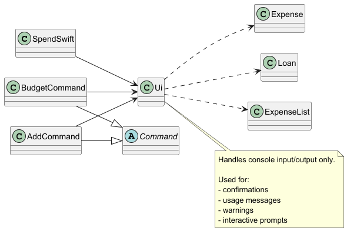
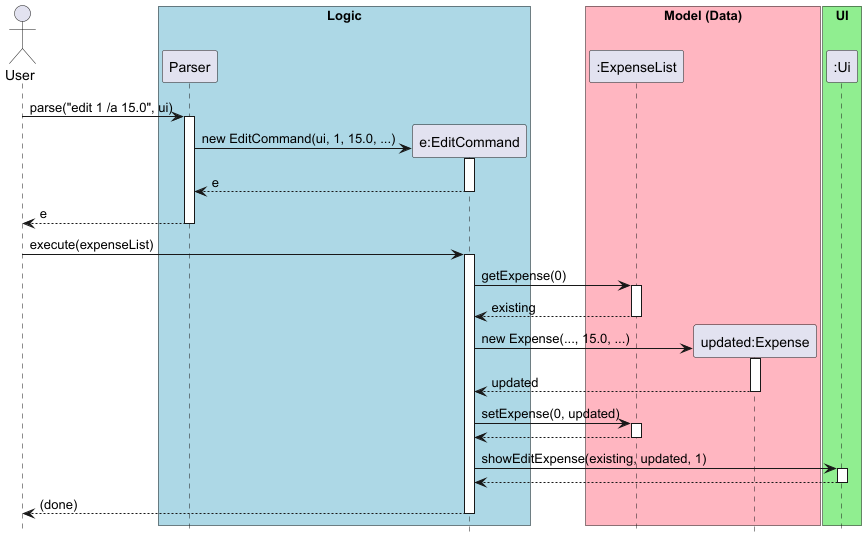
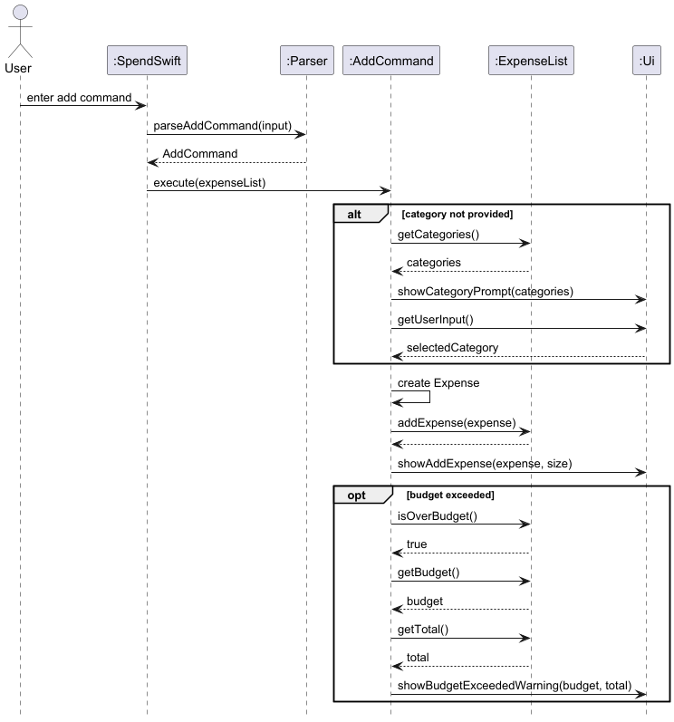
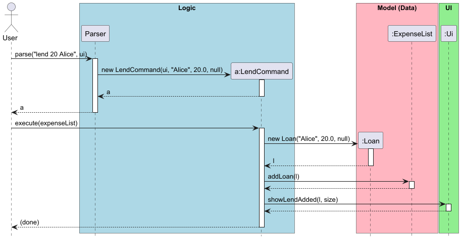
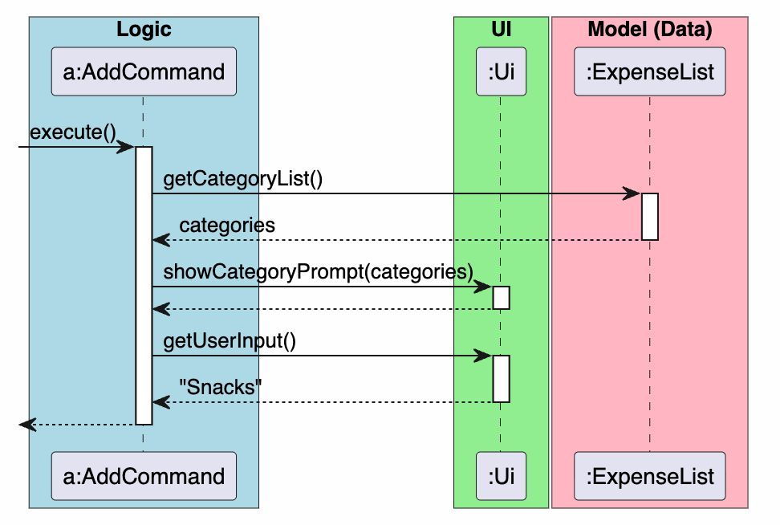
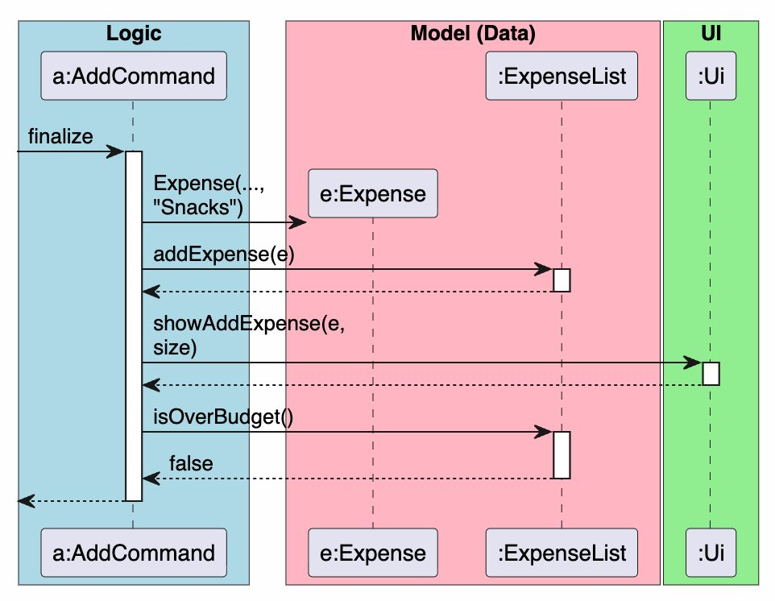
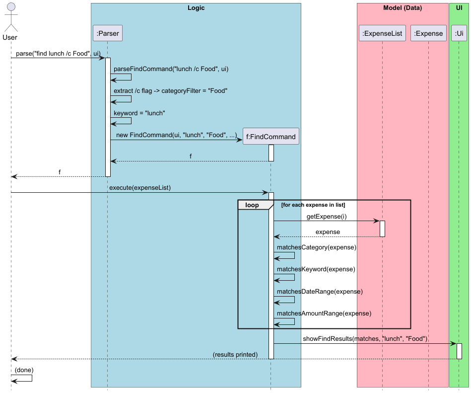
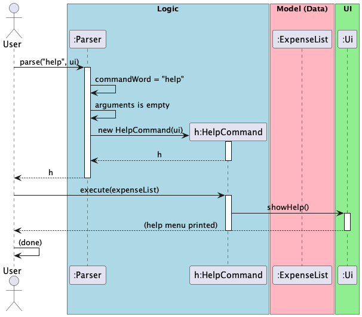
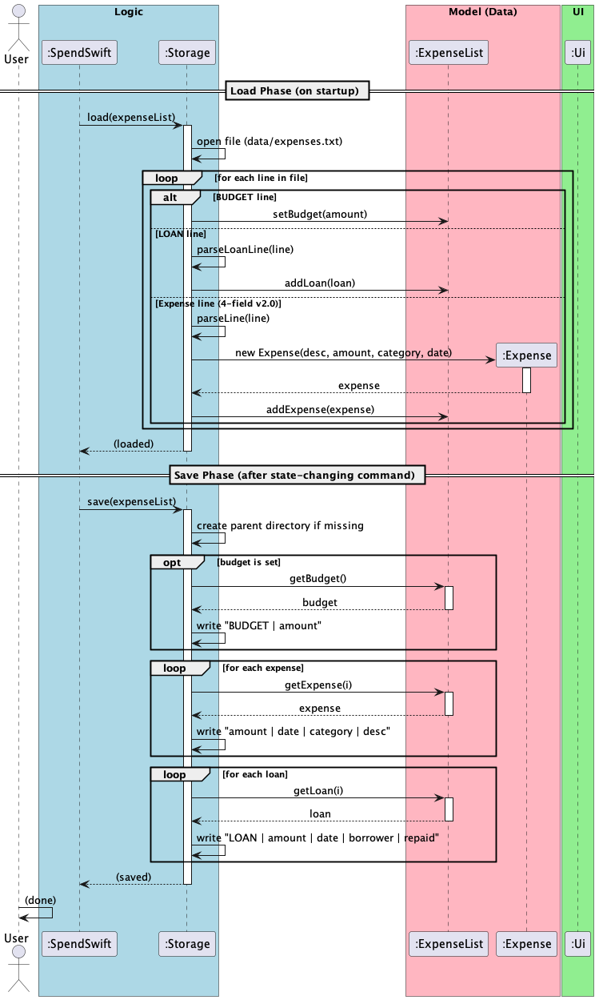
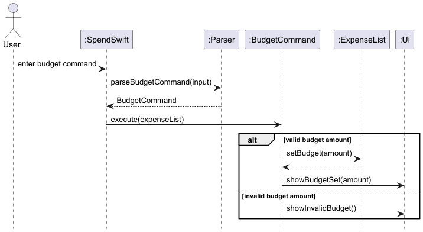

# Developer Guide

## Acknowledgements

* This project is heavily based on the [Duke project template](https://se-education.org/duke/) created by the [SE-EDU initiative](https://se-education.org).
* Testing is supported by the [JUnit 5](https://junit.org/junit5/) framework.
* Project structure and documentation draw inspiration from the SE-EDU guidelines.

## Design & implementation

### Ui Component

The `Ui` component centralises all user-facing input and output in SpendSwift. It is responsible for displaying confirmation messages, warnings, usage hints, summaries, and interactive prompts.

Unlike the business logic classes, `Ui` does not modify application state. Instead, command classes delegate user interaction responsibilities to it. For example, `AddCommand` uses `Ui` to display success messages and category prompts, while `BudgetCommand` uses it to show budget confirmations or invalid-budget warnings.

This design improves separation of concerns:
- command classes remain focused on application logic
- output formatting is kept in one place
- user interaction stays consistent across features

Below is a simplified class diagram showing how the `Ui` component is used by the main application flow and command classes:

*Figure 1: Simplified class diagram showing how the `Ui` component interacts with the application flow and command classes.*

**Design Considerations:**
- **Why centralise output in `Ui`?** Centralising output avoids duplicated `System.out.println(...)` logic across commands and makes message formatting easier to maintain.
- **Why allow `Ui` to read input as well?** The interactive category prompt requires the application to pause and collect additional user input after command parsing. Keeping this responsibility inside `Ui` prevents command classes from dealing directly with low-level console input.
- **Trade-off:** The `Ui` class contains many specialised methods, which makes it longer. However, this was preferred over spreading presentation logic throughout the codebase.

### Delete Feature

The delete feature allows users to remove an existing expense from their tracking list by providing its 1-based index (e.g., `delete 1`).

**How it works:**

The user types `delete` followed by a single positive integer representing the expense's index.

**Implementation:**

`Parser.parseDeleteCommand()` splits the input string. It first verifies there is exactly one argument and then attempts to parse it into an integer. If the argument is missing, non-numeric, or zero/negative, it catches the parsing issues (or returns `null`) and tells `Ui` to show an invalid index message.

A valid integer index results in the instantiation of a `DeleteCommand`.

Below is the sequence of interactions when the user enters a valid command like `delete 1`:

*Figure 2: Sequence Diagram detailing the Delete feature execution.*

`DeleteCommand.execute()` operates by:
1. Validating that the given index is greater than `0`.
2. Attempting to call `ExpenseList.deleteExpense(index - 1)`. 
3. Catching an `IndexOutOfBoundsException` if the index given is larger than the actual list's bounds, showing an error via the `Ui`.
4. Successfully removing the item and showing a success message via `Ui.showDeleteExpense()`.

Because deletion permanently removes persisted data, `DeleteCommand.shouldPersist()` returns `true`, triggering a file save sequentially.

### Edit Expense Feature

The edit feature allows users to modify one or more fields of an existing expense using the `edit` command.

**How it works:**
The user provides a 1-based index followed by one or more optional flags:
- `/a` to update the monetary value
- `/de` to update the description
- `/c` to update the category
- `/da` to update the date (must follow `YYYY-MM-DD` format)

At least one flag must be supplied; omitted fields retain their existing values.

**Implementation:**
`Parser.parseEditCommand()` extracts the index and each flag from the input string sequentially. Each flag is located by its keyword using `indexOf()`, its value is extracted up to the next `/` or the end of the input, and then it is stripped from the working string before the next flag is processed. This substring manipulation algorithm allows flags to appear in any order without ambiguity.

Once all fields are parsed, an `EditCommand` is constructed with nullable fields for each of the four attributes.

Below is the sequence of interactions when the user enters a valid command like `edit 1 /a 15.0`:

*Figure 3: Sequence Diagram detailing the Edit feature execution.*

In `EditCommand.execute()`, the existing `Expense` at the given index is retrieved, each non-null field replaces the corresponding existing value, and a new `Expense` object is created and written back via `ExpenseList.setExpense()`.

**Design considerations:**
`Expense` objects are immutable (all fields are `final`), so editing produces a new `Expense` rather than mutating the existing one. An alternative considered was making `Expense` mutable with setter methods, but immutability was preferred to avoid unintended side effects across the codebase.

### Add Feature

The add feature allows users to record a new expense with a description, amount, optional category, and optional date.

**How it works:**
The user enters `add` followed by an amount and a description. The `/c` and `/da` flags may optionally be supplied to specify a category and date respectively.

**Implementation:**
`Parser.parseAddCommand()` first extracts the mandatory amount, then strips the optional `/c` and `/da` flags from the remaining input. The text left behind becomes the description. This allows the user to provide optional flags in any order without affecting parsing correctness.

A valid command results in the creation of an `AddCommand` object.

Below is the sequence of interactions when the user enters a valid command such as `add 5.50 Coffee /c Food`:

*Figure 4: Sequence Diagram detailing the Add feature execution.*

`AddCommand.execute()` operates by:
1. Checking whether a category was provided.
2. Triggering an interactive category prompt via `Ui` if the category is missing.
3. Creating a new `Expense` object with the resolved fields.
4. Adding the expense to `ExpenseList`.
5. Calling `Ui.showAddExpense()` to display a confirmation message.
6. Checking whether the newly added expense causes the total spending to exceed the budget.

**Design Considerations:**
- **Why support optional category and date flags?** This keeps the command flexible for both quick entry and detailed record keeping.
- **Why allow interactive category resolution after parsing?** It reduces friction for users who forget the `/c` flag, while still maintaining accurate categorisation.
- **Why keep budget checks outside the parser?** Parsing should only interpret user input. Budget validation belongs to the execution stage, after the expense has been created and added.

### Category and Date Parsing

Commands like `add` and `edit` support optional flags such as `/c` for category and `/da` for date.

`Parser` implements a robust stripping algorithm. For example, in `Parser.parseAddCommand()`, it first extracts the mandatory amount, then strips the `/da` and `/c` flags from the remaining input one at a time. The date token is parsed with `ResolverStyle.STRICT` to reject impossible calendar dates such as `2026-02-30`. Whatever text remains after the specified flags are removed becomes the description, which means the description does not need to appear in a fixed position relative to the flags.

### Loan Tracking System

The Loan Tracking System allows users to manage debts separately from their primary expenses.

**Implementation:**
The system is centered around the `Loan` class, which extends the `Expense` class to reuse validation logic but introduces a `borrowerName` and an `isRepaid` boolean flag.

The ledger is managed by three specific commands:

1. **LendCommand**: Instantiates a `Loan` object and adds it to the internal `ArrayList<Loan>` managed by `ExpenseList`.

Below is the sequence of interactions when the user enters a valid command like `lend 20 Alice`:

*Figure 5: Sequence Diagram detailing the Lend feature execution.*

2. **LoansCommand**: Queries the `Ui` to display the current outstanding balance. It handles the `/all` flag to show both outstanding and settled debts.
3. **RepayCommand**: Rather than using an absolute index of the entire loan array, `RepayCommand` fetches a filtered list via `ExpenseList.getOutstandingLoans()`. The user's 1-based index is mapped to this dynamic list, and the selected loan is marked as repaid.

**Storage Integration:**
To persist this parallel data structure, the `Storage` class was modified to support multiple data types in a single file. Loan entries are prefixed with the `LOAN |` marker (e.g., `LOAN | 20.0 | 2026-04-01 | Alice | false`). During `load()`, the `Storage` class identifies this prefix, parses the loan using `parseLoanLine()`, and routes it to `ExpenseList.addLoan()` rather than the standard expense list.

**Design Consideration:**
- **Separate Ledgers**: We chose to keep loans in a separate list rather than the main `ExpenseList` to prevent temporary debt from skewing the "Statistics" and "Budget" features, which are intended strictly for personal spending analysis.
- **Dynamic Repayment Indexing**: By mapping the `repay INDEX` to the *outstanding* loans list rather than the full historical list, we vastly improved the UX, preventing the user from having to manually count past, settled debts.

### Interactive Category Selection

**Overview**
The application features a dynamic, interactive category selection mechanism. When a user attempts to add an expense without explicitly providing a category flag (`/c`), the application gracefully pauses execution, displays a numbered list of available categories, and prompts the user to select an existing category or input a new one.

This feature ensures that users do not accidentally pollute a default "Others" category due to forgetfulness, maintaining the integrity of their financial tracking while providing a seamless User Experience (UX).

**Implementation**
The interactive category selection mechanism is primarily orchestrated by the `AddCommand` class, acting as the controller. It interacts heavily with the `Ui` class for presentation and the `ExpenseList` class for state management.

To ensure the architecture remains decoupled and follows the Single Responsibility Principle, the execution flow is broken down into three distinct phases: **UI Interaction**, **Category Resolution**, and **Expense Finalization**.

#### Phase 1: The UI Interaction Prompt
When `AddCommand#execute(ExpenseList)` is invoked, it first evaluates the `category` field parsed from the user's initial input. If this field is `null`, the command intercepts the normal execution flow to query the user.

1. `AddCommand` fetches the current master list of categories from `ExpenseList`.
2. It passes this list to `Ui#showCategoryPrompt()`, which formats and prints a numbered list to the terminal.
3. `AddCommand` then suspends execution by calling `Ui#getUserInput()`, waiting for the user to type their selection.

*Figure 6: Sequence Diagram detailing the UI Interaction phase.*

#### Phase 2: Dynamic Category Resolution
Once the user provides an input string, `AddCommand` must determine if the user typed a number (selecting an existing category) or a word (creating a brand new category).

If the user types a new category name (e.g., "Snacks"), `AddCommand` delegates the formatting and storage to `ExpenseList`. The `ExpenseList#addCategory()` method formats the string to Title Case (e.g., "snacks" -> "Snacks") and dynamically inserts it into the master list just above the "Others" category. This ensures "Others" always remains safely at the bottom of the user's UI prompt.

*Figure 7: Sequence Diagram detailing the parsing and dynamic storage of a new category.*

#### Phase 3: Expense Finalization & Budget Checking
With the category definitively resolved (either extracted from the numbered list or dynamically created), the `AddCommand` proceeds to finalize the data mutation.

1. A new `Expense` object is instantiated with the resolved category.
2. The object is appended to the `ExpenseList` via `addExpense()`.
3. `Ui#showAddExpense()` is called to print the success confirmation.
4. Finally, `AddCommand` queries `ExpenseList#isOverBudget()`. If the new expense pushes the total over the user's defined limit, it triggers a warning message via the `Ui`.

*Figure 8: Sequence Diagram detailing the final object creation and budget validation.*

**Design Considerations: Why it was implemented this way**
* **Strict Decoupling (Single Responsibility Principle):** The `AddCommand` acts strictly as an orchestrator. The `Ui` class knows nothing about how categories are saved, and the `ExpenseList` class knows nothing about `Scanner` inputs. They never communicate directly, which makes the codebase highly testable and modular.
* **The Open-Closed Principle for Categories:** Instead of hardcoding categories inside a Java `Enum` (which would require a code rewrite to add new ones), storing a dynamic `ArrayList<String>` inside `ExpenseList` allows the application to grow with the user's personalized spending habits.

**Alternatives Considered**
* **Alternative 1 (Strict Formatting Validation):** * *Design:* Throw an `IllegalArgumentException` in the `Parser` if the `/c` flag is missing, forcing the user to retype the entire command.
   * *Pros:* Very easy to implement. Keeps `AddCommand` execution strictly linear without needing pauses.
   * *Cons:* Creates a highly frustrating User Experience (UX). Power users typing quickly will constantly hit validation errors for forgetting a simple flag.
* **Alternative 2 (Silent Defaulting):** * *Design:* Automatically assign the expense to an "Others" category without prompting the user.
   * *Pros:* Immediate execution; keeps the `AddCommand` logic simple.
   * *Cons:* Leads to messy, inaccurate financial tracking. Users end up with the majority of their expenses dumped into a useless "Others" category, completely defeating the purpose of a budgeting application. The interactive prompt forces accurate categorization without making the user retype their description and amount.

### Predictive Spending Forecast
The `forecast` feature allows users to project their end-of-month spending based on current habits.

**Implementation details:**
The mechanism is contained within `ForecastCommand`. Because forecasting is an analytical action, `ForecastCommand#shouldPersist()` explicitly returns `false`, ensuring no unnecessary I/O operations are triggered.

1. The command fetches the current date using `LocalDate.now()` and extracts the current day and total days in the month.
2. It queries `ExpenseList#getTotalAmountForMonth(currentMonth)` to get the `spentSoFar` variable.
3. The formula `(spentSoFar / currentDay) * daysInMonth` is used to calculate the projected total.
4. A failsafe is included `(currentDay == 0 ? 1 : currentDay)` to ensure that if a user executes the command at the exact start of a new month, the application does not throw an `ArithmeticException` for division by zero.
### Find / Filter Feature

The find feature allows users to search and filter their expense list using a keyword and/or a combination of optional flags.

**How it works:**
The user types `find` followed by an optional keyword and any combination of the following flags:
- `/c CATEGORY` — filter by exact category match (case-insensitive)
- `/dmin DATE` — include only expenses on or after this date
- `/dmax DATE` — include only expenses on or before this date
- `/amin AMOUNT` — include only expenses at or above this amount
- `/amax AMOUNT` — include only expenses at or below this amount
- `/sort asc|desc` — sort results by amount (ascending or descending)

All filters are composable: `find lunch /c Food /amin 5 /sort asc` finds expenses containing "lunch" in the Food category costing at least $5, sorted cheapest-first.

**Implementation:**
`Parser.parseFindCommand()` strips each recognised flag from the input string one at a time, using the same `indexOf()`-based algorithm as `parseAddCommand()`. The remaining text after all flags have been extracted becomes the keyword. If neither a keyword nor any filter flag is present, usage help is shown and `null` is returned.

A `FindCommand` is constructed with all seven parameters (keyword, category, dateMin, dateMax, amountMin, amountMax, sortOrder). During execution, each expense is tested against four private predicate methods — `matchesCategory()`, `matchesKeyword()`, `matchesDateRange()`, and `matchesAmountRange()` — each of which returns `true` when its corresponding filter is `null` (i.e., not set). This design means all filters are independently optional and composable without any conditional branching in the main loop.

Below is the sequence of interactions when the user enters `find lunch /c Food`:

*Figure 9: Sequence Diagram detailing the Find feature execution.*

If `/sort` is specified, `sortMatches()` applies a `Comparator.comparingDouble(Expense::getAmount)` (reversed for `desc`) to the result list before display.

Because `find` is a read-only query, `FindCommand.shouldPersist()` returns `false`.

**Design Considerations:**
- **Why private predicate methods instead of one large `if`?** Extracting `matchesCategory()`, `matchesKeyword()`, `matchesDateRange()`, and `matchesAmountRange()` into separate methods keeps the main loop readable and makes it easy to add new filter dimensions in the future without touching existing logic.
- **Why sort in the command rather than delegating to `ExpenseList`?** The sort only applies to the filtered result set, not the entire expense list. Sorting a temporary `ArrayList` avoids mutating persisted state for a read-only operation.

---

### Help Feature

The help feature displays all available commands and their usage formats.

**How it works:**
The user types `help` with no arguments. Trailing text is rejected.

**Implementation:**
`HelpCommand` is one of the simplest commands in the system. It contains no business logic — its `execute()` method delegates entirely to `Ui.showHelp()`, which prints a formatted list of every command, its flags, and a short description.

Below is the sequence of interactions when the user enters `help`:

*Figure 10: Sequence Diagram detailing the Help feature execution.*

Because help is read-only, `HelpCommand.shouldPersist()` returns `false`.

---

### Storage & Persistence

The `Storage` class is responsible for reading and writing all application data to `data/expenses.txt`, ensuring data persists between sessions.

**How it works:**
On startup, `SpendSwift` calls `Storage.load()` to populate the `ExpenseList`. After every state-changing command (where `shouldPersist()` returns `true`), `SpendSwift` calls `Storage.save()` to write the full dataset back to disk.

**Implementation:**
The data file uses a pipe-delimited format. Three types of lines are supported:

| Line type | Format |
|-----------|--------|
| Budget | `BUDGET \| amount` |
| Expense (v2.0) | `amount \| date \| category \| description` |
| Expense (v1.0, legacy) | `amount \| description` |
| Loan | `LOAN \| amount \| date \| borrower \| repaid` |

During `load()`, the `Storage` class identifies each line type by prefix or field count:
1. Lines starting with `BUDGET |` are parsed and passed to `ExpenseList.setBudget()`.
2. Lines starting with `LOAN |` are routed to `parseLoanLine()` and added via `ExpenseList.addLoan()`.
3. All other lines are parsed by `parseLine()`, which handles both 4-field (v2.0) and 2-field (v1.0 legacy) formats, creating `Expense` objects and adding them via `ExpenseList.addExpense()`.

Malformed or corrupt lines are skipped with a user-visible warning via `Ui.showMalformedLineWarning()`, ensuring the application never crashes on bad data.

Below is the sequence of interactions during load and save:

*Figure 11: Sequence Diagram detailing the Storage load and save phases.*

During `save()`, the `Storage` class:
1. Creates the parent directory if it does not exist.
2. Writes the budget line (if set).
3. Iterates over all expenses, writing each in v2.0 format.
4. Iterates over all loans, writing each with the `LOAN` prefix.

**Design Considerations:**
- **Why a single flat file instead of separate files for expenses, loans, and budget?** A single file simplifies atomic saves — either the entire state is written successfully or the previous version remains intact. Splitting across files introduces partial-write risks.
- **Why backward compatibility with 2-field lines?** Early v1.0 users had existing save files with only `amount | description`. Rather than requiring a migration step, `parseLine()` silently upgrades these to the current format (defaulting category to "Others" and date to today) on the next save cycle.
- **Why `ResolverStyle.STRICT` for date parsing?** Without strict mode, `LocalDate.parse("2026-02-30")` would silently adjust to Feb 28. Strict mode rejects impossible calendar dates outright, preventing silent data corruption.

---

### Input Validation (Strict Commands)

The `list`, `help`, `exit`, and `total` commands do not accept any arguments.
If trailing text is detected after these keywords, the parser calls `ui.showUnknownCommand()` and returns `null`, preventing silent misinterpretation of user input such as `help something` or `exit now`.

### Budget Feature

The budget feature allows users to set a spending limit and monitor their spending against that limit using the `budget` command.

**How it works:**
The user may enter:
- `budget AMOUNT` to set a budget
- `budget` to view the current budget status

**Implementation:**
`Parser.parseBudgetCommand()` determines whether the command is being used to set a new budget or to view an existing one.

If an amount is supplied, a `BudgetCommand` is constructed with that value. During execution, `BudgetCommand.execute()` validates that the amount is greater than `0`. If the amount is invalid, the command delegates to `Ui.showInvalidBudget()` and exits without modifying the stored budget.

If the amount is valid, the command updates the budget stored in `ExpenseList` and displays a confirmation message using `Ui.showBudgetSet()`.

Below is the sequence of interactions when the user enters a valid command such as `budget 100`:

*Figure 12: Sequence Diagram detailing the Budget feature execution.*

The current budget is stored in `ExpenseList`, together with the expenses it is evaluated against. This allows `ExpenseList` to compute total spending, remaining budget, and whether the current spending has exceeded the budget.

When a new expense is added through `AddCommand`, the application checks `ExpenseList.isOverBudget()`. If the newly updated total exceeds the stored budget, `Ui.showBudgetExceededWarning()` is triggered.

**Design Considerations:**
- **Why store the budget in `ExpenseList`?** The budget is tightly coupled to the expense data it is measured against, so storing them together keeps financial state centralised.
- **Why validate inside `BudgetCommand`?** Validation belongs to the execution step because the parser’s role is only to interpret command structure, not enforce business rules.
- **Why not keep budget checking inside `AddCommand` only?** That would scatter financial logic across commands. Centralising the budget state in `ExpenseList` results in cleaner object-oriented design.

### Sort Feature

The sort feature allows users to reorder their expense list either **alphabetically by category** or **chronologically by date** using the command `sort category` or `sort date`.

**How it works:**

The user types `sort` followed by exactly one criterion — `category` or `date`. Any other argument causes the parser to show a usage hint and return `null` without creating a command.

**Implementation:**

Below is the sequence of interactions when the user enters `sort category`:

*Figure 13: Sequence Diagram detailing the Sort feature execution.*

`SortCommand` delegates the actual reordering to `ExpenseList.sortExpenses(Comparator)`, which calls `java.util.Collections.sort(expenses, comparator)` in place. Two static `Comparator<Expense>` constants are pre-defined in `SortCommand`:

- `BY_CATEGORY` — uses `String.CASE_INSENSITIVE_ORDER` on `Expense.getCategory()`, with a fallback to sort by date (newest first) using `.thenComparing(Expense::getDate, Comparator.reverseOrder())`.
- `BY_DATE` — uses the reverse natural order of `LocalDate` via `Expense.getDate()` so the newest expenses appear first.

Because the sort modifies the list order that is persisted to file, `SortCommand.shouldPersist()` returns `true`, triggering a save after execution.

**Design Considerations:**

- **Why sort in place?** Mutating the list directly ensures that the sorted order is reflected in subsequent `list` commands and is saved to disk without extra copying.
- **Why static Comparators?** Declaring them as `public static final` fields on `SortCommand` makes them easily reusable and testable in isolation, without coupling the comparator logic to any single instance.
- **Alternative considered:** Returning a new sorted list and replacing the existing one. This was rejected because it would require `ExpenseList` to expose a method for replacing all its contents, adding unnecessary surface area to the API.

---

### Statistics Feature

The statistics feature provides a per-category breakdown of total spending using the `stats` command.

**How it works:**

The user types `stats` with no arguments. Trailing text is not allowed; if any arguments are detected, the parser shows an unknown-command message and returns `null`.

**Implementation:**

Below is the sequence of interactions when the user enters `stats`:

*Figure 14: Sequence Diagram detailing the Statistics feature execution.*

`StatisticsCommand.execute()` iterates over every expense in the list and accumulates per-category totals into a `LinkedHashMap<String, Double>`. Using a `LinkedHashMap` preserves the **insertion order**, so categories are printed in the order they first appear in the list — giving the output a predictable, intuitive feel.

The final map and expense count are then passed to `Ui.showStatistics()`, which formats each category-total pair as `CategoryName: $X.XX`.

Because `stats` is a read-only query, `StatisticsCommand.shouldPersist()` returns `false` — no file write is triggered.

**Design Considerations:**

- **Why `LinkedHashMap` instead of `HashMap`?** A plain `HashMap` has non-deterministic iteration order, which would cause the printed output to vary between runs. `LinkedHashMap` maintains insertion order at negligible extra cost.
- **Why `TreeMap` was not used?** `TreeMap` would sort categories alphabetically, which is a different concern from counting. Keeping the order user-defined (insertion order) is more intuitive for the `stats` command.
- **Alternative considered:** Computing statistics inside `Ui` itself. This was rejected because it would embed business logic in the presentation layer, violating the separation-of-concerns principle.

## Product scope

### Target user profile

* **Demographic:** University students (like those at NUS) and young professionals.
* **Habits:** Spends a lot of time on their computer/terminal, prefers typing over mouse interactions, and wants a fast, no-nonsense way to log daily expenses (like meals and transport).
* **Needs:** Needs a way to enforce a strict budget, categorize spending, and maintain data locally without relying on cloud services or slow mobile apps.

### Value proposition

SpendSwift solves the problem of friction in financial tracking. Most budgeting apps require navigating multiple menus and screens just to log a $5 coffee. SpendSwift allows power users to log, edit, and review their finances instantly using simple Command Line Interface (CLI) commands, keeping their hands on the keyboard and their focus unbroken.

## User Stories

|Version| As a ... | I want to ... | So that I can ...|
|--------|----------|---------------|------------------|
|v1.0|new user|see usage instructions|refer to them when I forget how to use the application|
|v1.0|user|add an expense with a description and amount|keep track of what I have spent|
|v1.0|user|delete an expense by index|remove entries I added by mistake|
|v1.0|user|list all my expenses|see everything I have spent at a glance|
|v1.0|user|see my total spending|get a quick snapshot of how much I have spent overall|
|v2.0|user|assign a category and date to an expense|organise my spending history|
|v2.0|user|edit an existing expense|correct mistakes without deleting and re-adding entries|
|v2.0|user|find expenses by keyword|locate specific expenses without scrolling through the entire list|
|v2.0|user|filter expenses by category, date, or amount|narrow down my spending records to what I need|
|v2.0|user|see a help menu|quickly recall all available commands and their formats|
|v2.0|user|have my data saved automatically|not lose my expense history when I close the app|
|v2.0|user|set a monthly budget|control my spending and stay within a limit|
|v2.0|user|view my budget status|see how much I have left to spend this month|
|v2.0|user|be warned when I exceed my budget|take corrective action before overspending|
|v2.0|user|sort my expenses by category|group similar spending items together for review|
|v2.0|user|sort my expenses by date|see my most recent expenses first|
|v2.0|user|sort my expenses by amount|identify my largest expenses quickly|
|v2.0|user|view spending statistics by category|understand where my money is going|
|v2.0|user|view a yearly budget dashboard|see month-by-month trends and budget utilisation at a glance|
|v2.0|user|lend money and track it separately|keep personal loans out of my expense totals|
|v2.0|user|view outstanding loans|know who still owes me money|
|v2.0|user|mark a loan as repaid|keep my loan ledger accurate and up to date|
|v2.0|user|see a spending forecast|know if I am on track to stay within my budget this month|
|v2.0|user|delete expenses by category|quickly remove all items from a category at once|
|v2.0|user|delete expenses by date|quickly remove all items from a specific day at once|
|v2.0|user|clear all expenses|start fresh with a clean expense list|
|v2.0|user|list expenses for a specific month|review my spending for a particular time period|

## Non-Functional Requirements

1. **Performance:** The system should respond to any user command within 2 seconds.
2. **Portability:** The application must work seamlessly across Windows, macOS, and Linux environments, provided Java 17 or higher is installed.
3. **Data Integrity:** The application must safely persist data to a local text file (`data/expenses.txt`) and be able to recover or skip corrupted lines without crashing.
4. **Usability:** A user with average typing speed should be able to log a new expense faster than using a GUI-based mobile application.

## Glossary

* **CLI (Command Line Interface)** - A text-based user interface used to interact with the application by typing commands.
* **Architecture** - The overall structural design of the software, determining how different components (like Parser, Storage, and Commands) interact.
* **Persisted Data** - Information that is saved to the user's hard drive (in `expenses.txt`) so it is not lost when the application closes.

## Instructions for manual testing

Given below are instructions to test the app manually.

### Launch and Shutdown
1. **Initial launch:** Download the latest `.jar` file and copy it into an empty folder.
2. Open your terminal, navigate to the folder, and run `java -jar SpendSwift.jar`.
   * *Expected:* The welcome message appears, and a `data` folder is created in the same directory.
3. **Shutdown:** Type `exit` and press Enter.
   * *Expected:* The farewell message is shown and the application terminates.

### Testing the Add Command (v2.0 Features)
1. **Test adding with all parameters:**
   * Run: `add 5.50 Chicken Rice /c food /da 2026-03-24`
   * *Expected:* The expense is added. Typing `list` should show the expense with `[Cat: food]` and `[Date: Mar 24 2026]`.
2. **Test interactive category selection:**
   * Run: `add 2.00 Bus`
   * *Expected:* The application displays a numbered category prompt. Enter either a valid category number or a new category name. The expense should then be added with the chosen category and today's date.
3. **Test invalid date format:**
   * Run: `add 10.00 Movie /da 24-03-2026`
   * *Expected:* An error message prompts the user to use the `YYYY-MM-DD` format. The expense is *not* added.

### Testing the Find Command
1. **Test keyword search:**
   * Run: `add 5.50 Coffee /c Food /da 2026-01-10`, then `find coffee`
   * *Expected:* The matching expense containing "Coffee" is displayed.
2. **Test category filter:**
   * Run: `find /c Food`
   * *Expected:* Only expenses in the "Food" category are shown.
3. **Test date range filter:**
   * Run: `find /dmin 2026-01-01 /dmax 2026-06-30`
   * *Expected:* Only expenses within the specified date range are shown.
4. **Test amount range filter:**
   * Run: `find /amin 5 /amax 20`
   * *Expected:* Only expenses between $5.00 and $20.00 are shown.
5. **Test sort order:**
   * Run: `find /c Food /sort desc`
   * *Expected:* Food expenses are listed from highest to lowest amount.
6. **Test no match:**
   * Run: `find xyznonexistent`
   * *Expected:* A "No expenses found" message is displayed.

### Testing the Help Command
1. **Test help output:**
   * Run: `help`
   * *Expected:* A formatted list of all available commands and their formats is displayed.
2. **Test help with trailing arguments:**
   * Run: `help something`
   * *Expected:* An "Unknown command" error is shown.

### Testing the Budget Feature
1. **Setting a budget:**
   * Run: `budget 50`
   * *Expected:* A confirmation message states the budget is set to $50.00.
2. **Exceeding the budget:**
   * Run: `add 60.00 Textbook`
   * *Expected:* The expense is added, but the UI triggers a "Budget Exceeded" warning message.
3. **Viewing the current budget:**
   * Run: `budget`
   * *Expected:* The current budget, total spent, and remaining budget (or exceeded amount) are displayed.

4. **Invalid budget input:**
   * Run: `budget 0`
   * *Expected:* An invalid budget message is shown and the current budget remains unchanged.

### Automated Test Coverage

The project uses JUnit 5 for automated testing. Test suites exist for every command class, the `Parser`, `Storage`, `ExpenseList`, `Expense`, `Loan`, and `Ui`. Integration tests in `SpendSwiftTest` verify end-to-end workflows including persistence across restarts.

As of the latest build, the project achieves **97% line coverage** and **84% branch coverage** across all classes. The remaining uncovered branches are primarily:
- **Assertion branches**: Java `assert` statements are counted as branches by JaCoCo. Since assertions verify invariants that are always true in correct code, these branches are intentionally never taken during normal execution.
- **IOException catch blocks**: Error paths in `Storage` that fire only on filesystem failures (disk full, permission denied). These are platform-dependent and not practical to trigger in portable JUnit tests.
